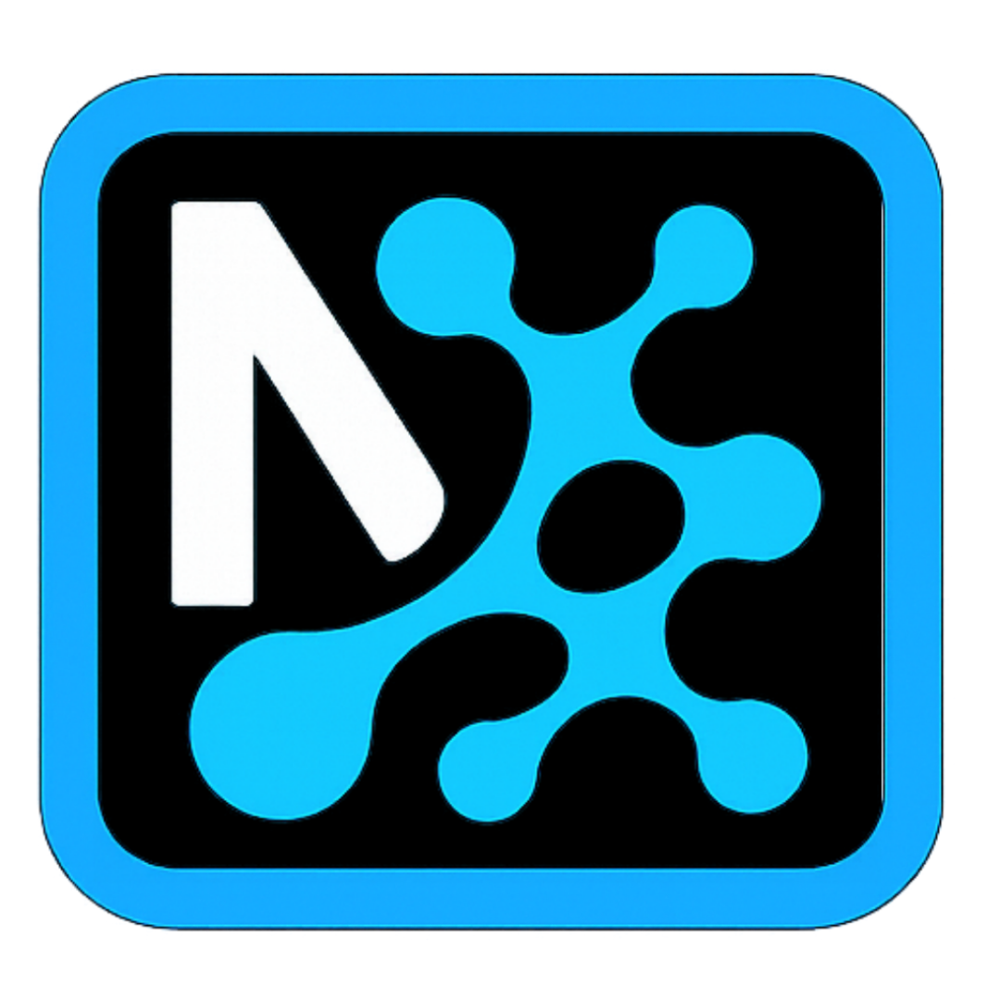

# NIA Browser

<p align="center">
  
</p>

<p align="center">
  <strong>Smart Developer Browser with Advanced DevTools</strong>
</p>

<p align="center">
  A powerful mobile browser designed specifically for web developers and power users, combining the convenience of mobile browsing with professional development tools.
</p>

## ✨ Features

### 🔧 Developer Tools
- **Live DevTools**: Full browser DevTools with console, network monitor, and element inspector
- **JavaScript Execution**: Run custom scripts and snippets on any webpage
- **Greasemonkey Support**: Install and manage userscripts with advanced compatibility
- **Network Monitor**: Track all network requests with detailed headers and response data
- **Performance Metrics**: Real-time performance monitoring and Core Web Vitals

### 🌐 Advanced Browsing
- **Multi-Tab Support**: Efficient tab management with gesture navigation
- **Desktop Mode**: Full desktop user agent and rendering
- **Safe Mode**: Disable all scripts and extensions for secure browsing
- **Dark Mode**: Full dark theme support for all components
- **Smart Bookmarks**: Advanced favorites management with search

### 🛠️ Developer Utilities
- **Source Code Viewer**: View and analyze page HTML with syntax highlighting
- **CRUD Testing**: Built-in REST API testing tools
- **Screenshot Capture**: Save full-page screenshots to device gallery
- **Storage Inspector**: Monitor cookies, localStorage, and sessionStorage
- **Eruda Integration**: Advanced mobile debugging console

## 🚀 Getting Started

### Prerequisites
- Node.js (v16 or higher)
- Expo CLI (`npm install -g @expo/cli`)
- Android Studio (for Android development)
- Xcode (for iOS development, macOS only)

### Installation

1. Clone the repository:
```bash
git clone https://github.com/zizwar/niabrowser.git
cd niabrowser
```

2. Install dependencies:
```bash
npm install
```

3. Start the development server:
```bash
npm start
```

### Available Scripts

- `npm start` - Start the Expo development server
- `npm run android` - Run on Android device/emulator
- `npm run ios` - Run on iOS simulator (macOS only)
- `npm run web` - Run in web browser

## 📱 Building for Production

### Android (Google Play Store)

1. Configure your app signing:
```bash
expo configure
```

2. Build APK:
```bash
eas build --platform android
```

3. Build AAB (for Play Store):
```bash
eas build --platform android --profile production
```

### iOS (App Store)

1. Configure iOS build:
```bash
eas build --platform ios
```

## 🏗️ Architecture

NIABrowser is built using:
- **React Native & Expo**: Cross-platform mobile development
- **React Native WebView**: Advanced web rendering engine
- **Context API**: State management
- **AsyncStorage**: Local data persistence
- **Expo Modules**: Native functionality integration

## 📖 Documentation

### Key Components

- `App.js` - Main application component and state management
- `WebViewContainer.js` - Core WebView wrapper with embedded scripts
- `DevTools.js` - Developer tools interface
- `ScriptManager.js` - Userscript management system
- `NetworkLogModal.js` - Network request monitoring

### State Management

The app uses React Context for global state:
- Tab management
- Settings (dark mode, desktop mode)
- Scripts and bookmarks
- History and favorites

## 🤝 Contributing

We welcome contributions! 

### Development Setup

1. Fork the repository
2. Create a feature branch
3. Make your changes
4. Test thoroughly
5. Submit a pull request

## 📄 License

This project is licensed under the MIT License - see the [LICENSE](LICENSE) file for details.

## 🔒 Privacy

NIABrowser respects your privacy:
- No data collection or tracking
- All data stored locally on your device
- Open source for transparency
- See our [Privacy Policy](privacy.html) for details

## 📞 Support

- **Issues**: [GitHub Issues](https://github.com/zizwar/niabrowser/issues)
- **Discussions**: [GitHub Discussions](https://github.com/zizwar/niabrowser/discussions)
- **Email**: [contact@niabrowser.com]

## 🏆 Acknowledgments

- Expo team for the amazing framework
- React Native WebView contributors
- Eruda developers for mobile debugging tools
- Open source community for inspiration